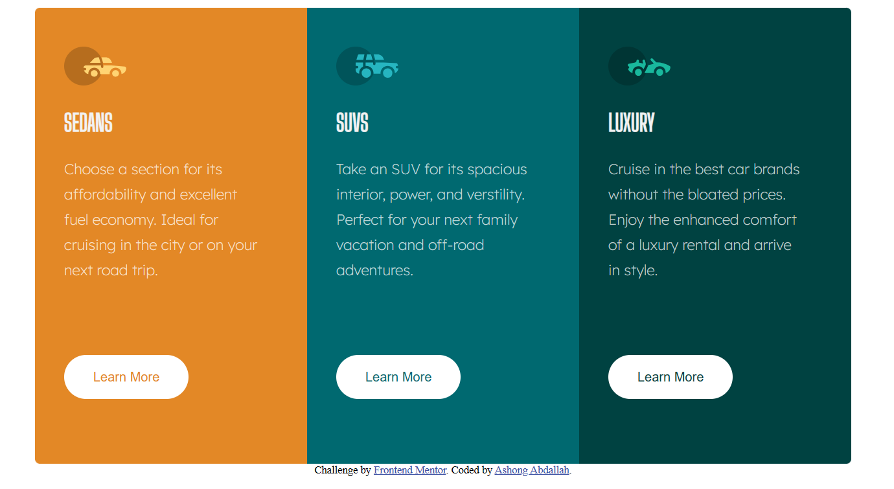

# Frontend Mentor - 3-column preview card component solution

This is a solution to the [3-column preview card component challenge on Frontend Mentor](https://www.frontendmentor.io/challenges/3column-preview-card-component-pH92eAR2-). Frontend Mentor challenges help you improve your coding skills by building realistic projects. 

## Table of contents

- [Overview](#overview)
  - [The challenge](#the-challenge)
  - [Screenshot](#screenshot)
  - [Links](#links)
- [My process](#my-process)
  - [Built with](#built-with)
- [Author](#author)

## Overview

### Screenshot

### Links

- Solution URL: (https://www.frontendmentor.io/solutions/3-column-preview-card-component-AyKhfotW0M) 
- Live Site URL: (https://main-3-column-preview-card-component.netlify.app/)

## My process

### Built with

- HTML
- CSS
- Flexbox
- JavaScript

## Author

<!-- - Website - [Add your name here](https://www.your-site.com) -->
- Frontend Mentor - [@AshongAbdallah06](https://www.frontendmentor.io/profile/AshongAbdallah06)
- Twitter - [@XuGaR_2_0_0_6](https://www.twitter.com/@XuGaR_2_0_0_6)